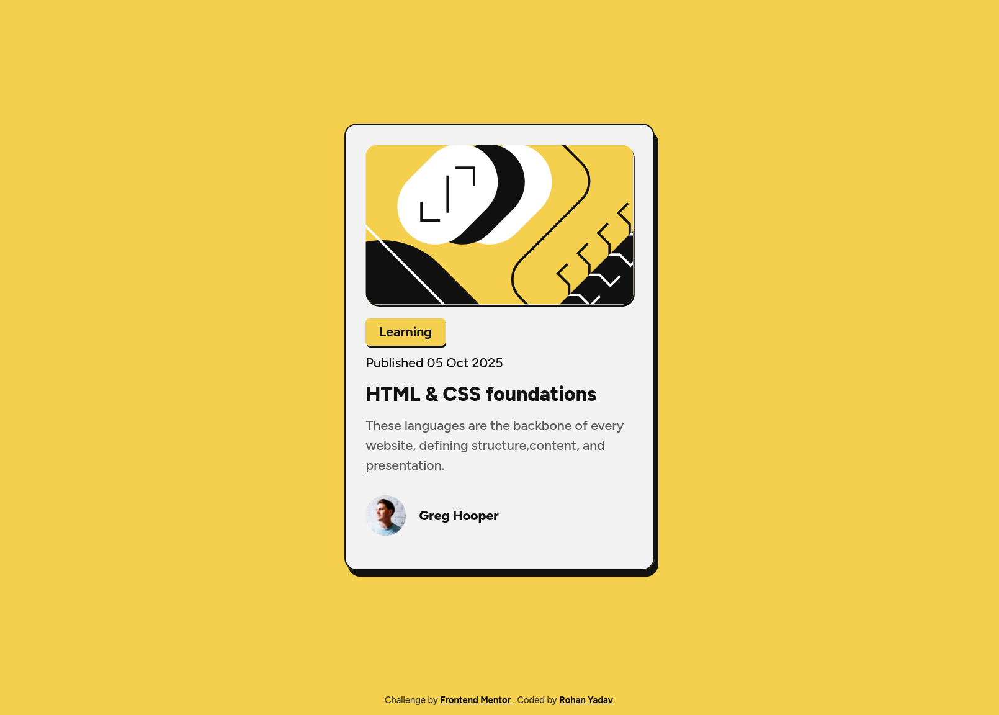
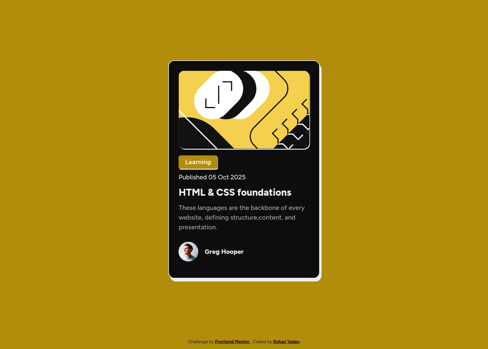

# Frontend Mentor - Blog preview card solution

This is a solution to the [Blog preview card challenge on Frontend Mentor](https://www.frontendmentor.io/challenges/blog-preview-card-ckPaj01IcS). Frontend Mentor challenges help you improve your coding skills by building realistic projects.

## Table of contents

-   [Overview](#overview)
    -   [The challenge](#the-challenge)
    -   [Screenshot](#screenshot)
    -   [Links](#links)
-   [My process](#my-process)
    -   [Built with](#built-with)
    -   [What I learned](#what-i-learned)
    -   [Useful resources](#useful-resources)
-   [Author](#author)

**Note: Delete this note and update the table of contents based on what sections you keep.**

## Overview

### The challenge

Users should be able to:

-   See hover and focus states for all interactive elements on the page

### Screenshot

### Links

-   Solution URL: [on github](https://your-solution-url.com)
-   Live Site URL: [via github pages](https://your-live-site-url.com)

## My process

### Built with

-   Semantic HTML5 markup
-   CSS custom properties
-   Flexbox
-   Mobile-first workflow

### What I learned

-   Every shadow on the page should share the same ratio, because the light is coming from the same source and that light source is not nearby like a campfire it is far away like sun.

-   Shadows imply elevation, the bigger the shadow the more elevated the element is. That means shadows create an illusion of depth.

-   I can create a somewhat mehh... dark theme by just subtracting the lightness value of the light theme's hsl from 100, like in this project in the light theme the background color `--bg-color: hsl(47, 88%, 63%);` then i subtracted 63 from 100 to get the dark theme version `--bg-color: hsl(47, 88%, 37%);`

### Useful resources

-   [MDN on box-shadows](https://developer.mozilla.org/en-US/docs/Web/CSS/box-shadow) - This helped me to understand about shadows.
-   [Designing beautiful shadows in css](https://www.joshwcomeau.com/css/designing-shadows/) - This is an amazing article which helped me to get a base sense about creating somewhat good shadows.

## Author

-   Frontend Mentor - [@r-yadav01](https://www.frontendmentor.io/profile/r-yadav01)
-   Twitter - [@r_yadav01](https://x.com/r_yadav01)
-   GitHub - [r-yadav01](https://github.com/r-yadav01)
